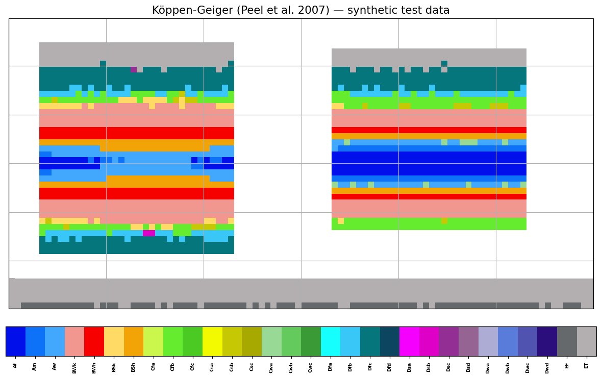
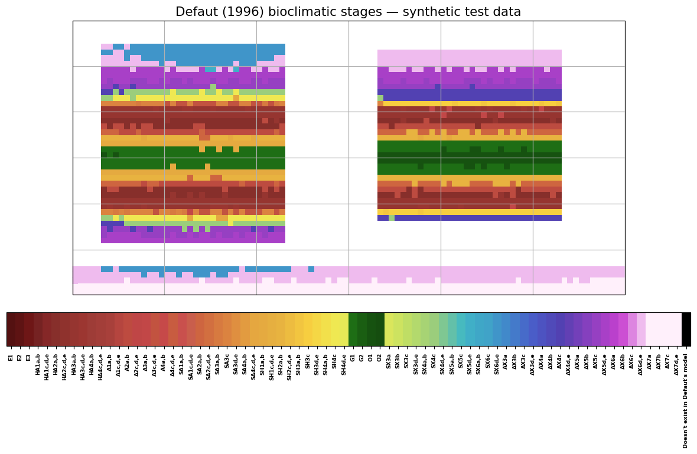

<!-- README shields loosely based on: https://github.com/othneildrew/Best-README-Template -->

<!-- PROJECT SHIELDS -->
[![Contributors][contributors-shield]][contributors-url]
[![Commits][commits-shield]][commits-url]
[![Stargazers][stars-shield]][stars-url]
[![Issues][issues-shield]][issues-url]
[![Apache-2.0 License][license-shield]][license-url]

# pyZonae

Gridded climate classification with pluggable rule sets. This is a modernized
merge of two codebases:

* **pyKoeppen** (Didier M. Roche, Didier Paillard) — Köppen-Geiger classifications
  in the Kottek (2006), Peel (2007), Cannon (2012) and Trewartha/Belda (2014)
  variants.
* **Defaut (1996)** bioclimatic stages (notebook by G. Bonneroy, 2026).

The two schemes now share one pipeline. You pick the rule with a single option,
`typ_classification`, whose accepted values are:

| value        | scheme                                   |
|--------------|------------------------------------------|
| `kottek`     | Köppen-Geiger, Kottek et al. 2006        |
| `peel`       | Köppen-Geiger, Peel et al. 2007          |
| `cannon`     | Köppen-Geiger, Cannon 2012               |
| `trewartha`  | Trewartha, Belda et al. 2014             |
| **`Defaut96`** | **Defaut (1996) bioclimatic stages**   |

## Install

```bash
pip install -r requirements.txt
```

Or install the package itself (which also provides a `pyzonae-classify`
command-line tool):

```bash
pip install .
```

`cartopy` is optional (used only to draw coastlines); everything runs without it.

## Quick start

No external or private data is required: pyZonae ships a **generator** for a
synthetic global climatology rather than the data files themselves (they are
reproducible, so there is no reason to version binaries). Generate them first —
this is a required first step, the `test-data/` directory starts out empty:

```bash
python scripts/make_synthetic_data.py --outdir test-data
```

This writes `synthetic_tas_monClim.nc`, `synthetic_pr_monClim.nc` and
`synthetic_sftlf.nc`. The generator is deterministic (fixed seed), so everyone
gets identical files. Then classify and plot:

```bash
# Köppen-Geiger (Peel)
python scripts/classify_map.py --classification peel \
    --tas test-data/synthetic_tas_monClim.nc \
    --pr  test-data/synthetic_pr_monClim.nc \
    --sftlf test-data/synthetic_sftlf.nc --save map_peel.png

# Defaut (1996)
python scripts/classify_map.py --classification Defaut96 \
    --tas test-data/synthetic_tas_monClim.nc \
    --pr  test-data/synthetic_pr_monClim.nc \
    --sftlf test-data/synthetic_sftlf.nc --save map_defaut.png
```

### What you should get

The two commands above produce these maps. The synthetic world has two
idealized continents, so the climate bands are symmetric about the equator —
which makes it easy to check at a glance that a classification is behaving
sensibly.

| Köppen-Geiger (Peel et al. 2007) | Defaut (1996) |
|---|---|
|  |  |

Köppen-Geiger shows the familiar A→B→C→D→E progression from equator to pole;
Defaut shows the analogous eremic → arid → … → axeric-nival gradient over the
same fields.

### Data conventions

The synthetic files follow the PMIP4/AWIESM convention so they work with both
this package **and** the original Bonneroy notebook, unmodified:

* `tas` in **Kelvin** (the notebook does an unconditional `tas - 273.15`);
* `pr` in **mm/month**;
* `sftlf` as a **percentage** (0–100).

**Variable names.** By default the loader auto-detects common names (`tas`,
`t2m`, `tmp`, … for temperature; `pr`, `prcp`, `tp`, … for precipitation;
`sftlf`, `lsm`, … for the mask). If your file uses something else, name it
explicitly:

```bash
python scripts/classify_map.py --classification peel \
    --tas my_file.nc --tas-var temperature_2m \
    --pr  my_file2.nc --pr-var total_precip ...
```

**Precipitation units.** Precipitation is converted to mm/month via `--pr-units`
(default `mm/month`, a no-op). Supported values: `mm/month`, `mm/day`,
`m/month`, `kg/m2/s` (the CMIP native flux) and `kg/m2/month`. Per-second and
per-day units are integrated to monthly totals using standard days-per-month.
For anything not covered, `--pr-scale F` applies an extra multiplicative factor
*after* the unit conversion. Examples:

```bash
# CMIP flux in kg m-2 s-1
python scripts/classify_map.py ... --pr-units kg/m2/s

# precipitation given in metres per month
python scripts/classify_map.py ... --pr-units m/month
```

**Temperature units.** `--tas-units auto` (default) converts to °C when the
field looks like Kelvin; force it with `--tas-units K` or `--tas-units C`.

On your own AWIESM (PMIP4) files, temperature is in Kelvin, so `auto` handles it;
you may also force it explicitly with `--tas-units K`:

```bash
python scripts/classify_map.py --classification Defaut96 \
    --tas PMIP4_tas_Amon_AWIESM1_piControl_monClim.nc \
    --pr  PMIP4_pr_Amon_AWIESM1_piControl_monClim.nc \
    --sftlf PMIP4_sftlf_fx_AWIESM1_piControl.nc \
    --tas-units K --save map_awiesm_defaut.png
```

## Library use

(Assumes you have run `make_synthetic_data.py` first, or substitute your own
NetCDF paths.)

```python
from pyzonae import run_classification
from pyzonae.plotting import plot_classification

class_map, labels, cmap, lons, lats = run_classification(
    typ_classification="Defaut96",
    tas_file="test-data/synthetic_tas_monClim.nc",
    pr_file="test-data/synthetic_pr_monClim.nc",
    sftlf_file="test-data/synthetic_sftlf.nc",
)
fig, ax = plot_classification(class_map, lons, lats, labels, cmap)
```

## Architecture

```
pyzonae/
├── io.py               # xarray loading (replaces lcm_utils/netCDF4)
├── derive.py           # 15 derived indices, incl. Gaussen 3-driest-months
├── classify.py         # dispatch: name -> classifier  (Defaut96 lives here)
├── cmaps.py            # colors + label dicts, one registry
├── plotting.py         # shared categorical map (cartopy optional)
├── run.py              # load -> derive -> classify -> map
├── cli.py              # argparse CLI (installed as `pyzonae-classify`)
└── classifiers/
    ├── koeppen.py      # KG/Trewartha logic (verbatim, NumPy-2 compatible)
    └── defaut.py       # Defaut tree, returns a key string
scripts/
├── make_synthetic_data.py   # writes the synthetic NetCDFs into test-data/
├── make_readme_figures.py   # regenerates the example maps in docs/images/
└── classify_map.py          # thin wrapper around pyzonae.cli
test-data/                   # empty in git; populated by make_synthetic_data.py
docs/images/                 # example maps shown in this README
tests/
└── test_pipeline.py         # pytest; builds its own data, needs no files on disk
```

### How a classifier plugs in

Every classifier takes the same per-cell index vector (see `derive.py`) and
returns a **key string** (e.g. `"Cfb"`, `"HA1a,b"`). `cmaps.py` maps that key to
an integer and a color. To add a new scheme you write one `get_*` function that
returns keys, one `*_cmap_*` function returning `(dict, colormap)`, and register
both — no change to the loading, plotting, or main loop.

## Notes on modernization

Relative to the original scripts:

* Removed the private `lcm_utils` / `progressbar` dependencies and hard-coded
  `/tertiaire/...` paths; all I/O is now xarray.
* Fixed `np.int` and `numpy.core._multiarray_umath` usage (broken on NumPy ≥ 1.24).
* Unified the two output conventions: the Defaut tree previously returned bare
  integers and now returns keys like the Köppen functions.
* Fixed a latent sentinel typo in the Defaut tree (`1000` → `10000`) and a
  missing `#` in one Defaut hex color.
* Summer/winter half-year precipitation is computed hemisphere-aware, and the
  Gaussen "three driest consecutive months" is vectorized.

## License

pyZonae is licensed under the **Apache License, Version 2.0** in its entirety.
See the [`LICENSE`](LICENSE) file for the full text and [`NOTICE`](NOTICE) for
attributions. Every source file carries an SPDX `Apache-2.0` header.

Attributions (all Apache-2.0):

* Köppen-Geiger classifications and colormaps (originally pyKoeppen) —
  © 2019-2022 Didier M. Roche; authors Didier M. Roche and Didier Paillard.
* Defaut (1996) bioclimatic classification, decision tree and colormap —
  © 2026 G. Bonneroy.
* Package architecture, xarray I/O, derived indices, dispatch, plotting,
  synthetic test-data generator and tests — © 2026 the pyZonae authors.

The Defaut scheme implements the method described in Defaut, B. (1996),
*La biogéographie des Orthoptères et la classification bioclimatique*,
Matériaux Entomocénotiques (cited for scientific attribution; the code is an
original Apache-2.0 implementation).

## Gaussen driest-3-months (a note on temperature units)

The Defaut scheme needs the total precipitation of the three consecutive driest
months, "driest" in the Gaussen sense (lowest P/T). This ratio must use
temperature on an **absolute scale (Kelvin)**: P/T is only meaningful for T > 0,
which Kelvin guarantees everywhere. Using Celsius makes the ratio negative below
0 C and wrongly selects cold months as "driest". `pyzonae` computes this ratio
in Kelvin, identifies the driest 3-month window, and sums that same window,
wrapping around the December-January boundary so boreal-winter dry seasons are
also considered.

## Contact

Didier M. Roche - [@dja_rosh](https://x.com/dja_rosh) - didier.roche@lsce.ipsl.fr

Project Link: [https://github.com/dmr-dj/pyZonae](https://github.com/dmr-dj/pyZonae)

<p align="right">(<a href="#readme-top">back to top</a>)</p>

<!-- Other stuff taken to get the shields correctly -->

[contributors-shield]: https://img.shields.io/github/contributors/dmr-dj/pyZonae
[contributors-url]: https://github.com/dmr-dj/pyZonae/graphs/contributors
[commits-shield]: https://img.shields.io/github/commit-activity/y/dmr-dj/pyZonae
[commits-url]: https://github.com/dmr-dj/pyZonae/graphs/commit-activity
[stars-shield]: https://img.shields.io/github/stars/dmr-dj/pyZonae
[stars-url]: https://github.com/dmr-dj/pyZonae/stargazers
[issues-shield]: https://img.shields.io/github/issues/dmr-dj/pyZonae
[issues-url]: https://github.com/dmr-dj/pyZonae/issues
[license-shield]: https://img.shields.io/github/license/dmr-dj/pyZonae
[license-url]: https://github.com/dmr-dj/pyZonae/blob/main/LICENSE

